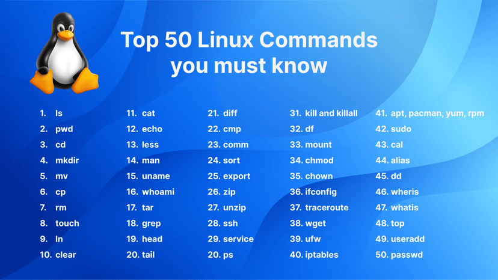

# Bash Overview

## What is a shell?

A shell is a command line interface to the computer system that serves 5 purposes:

- interpret commands
- set variables
- enable pipelines
- allow input/output redirection
- allow customization of users working environment

## Types of shells

Bash is the most common shell among linux/unix systems and Z Shell (zsh) is used as the default on Kali and recent versions of Mac OS. PowerShell is the de facto shell to use on windows systems that has also been available to linux and MacOS since 2016, but windows command interpreter is often used for simpler tasks (cmd). 

While each of these may have different features, they all serve to enable the 5 objectives above. 

For the purposes of this walkthrough, we will focus on bash. 

## Understanding commands

The first objective of a shell is to interpret commands. To see what commands are available to you, open a terminal and run: `compgen -c`

On my fresh Ubuntu install, that returns 4261 options!

Some of the more common commands that you will use are: 

You will learn most of these as you go, but will likely need to reference how they work from time to time. For most utilities you can reference the manual pages with the `man` command: 

`man ls`

The above command will show you how to use that utility and what other options it may have. For example `ls -alh` will show you all files/folders in the current terminal location (-a) to include hidden files, a "long" listing of all the files/folders that has extra information such as user permissions and last modification time (-l), and will display file sizes in a human readable format as opposed to bytes (-h)

There may be utilities that do not have man pages. That is okay. Most utilities will offer somthing similar if you type the command followed by either `-h` or `--help`. 

A newer utility for learning information about commands is the `info` utility. The syntax is just like looking at the manual pages, but will bring up a different type of cli with which to view information. you can use the arrow/paging keys to traverse the pages. if your key is over a line that starts with an asterisk, press enter to learn more about the topic and see detailed information. Press `q` to leave the interpretter. 

`info ls`

If all else fails, google and stack overflow are your best friends!

## Creating scripts with a text editor

Most distributions of linux will come with the nano and vim text editors. Nano is a more user friendly tool, whereas vim is designed more for developers. To open a new or existing file in your current terminal locations:

`nano <file>`

or 

`vim <file>`

In vim, to insert text press `i` to enter insert mode. Once the necessary changes to the file have been made hit the `esc` key and then type `:wq` to write the file and quit the session. 

In nano, it will show you the hot keys to save and exit the file at the bottom of the terminal window. 

These editors make writing in the command line easier as we will often need to string multiple lines of commands together or use structures that are easier to read if they are written on multiple lines. 

**Note:** vim may not be installed by default and you can run the following commands to install it:

Debian: `sudo apt install vim`
Red Hat: `sudo dnf install vim-enhanced`

**Note:** If you want to learn more about vim, play the game, Vim Adventures! https://ai79.me/
