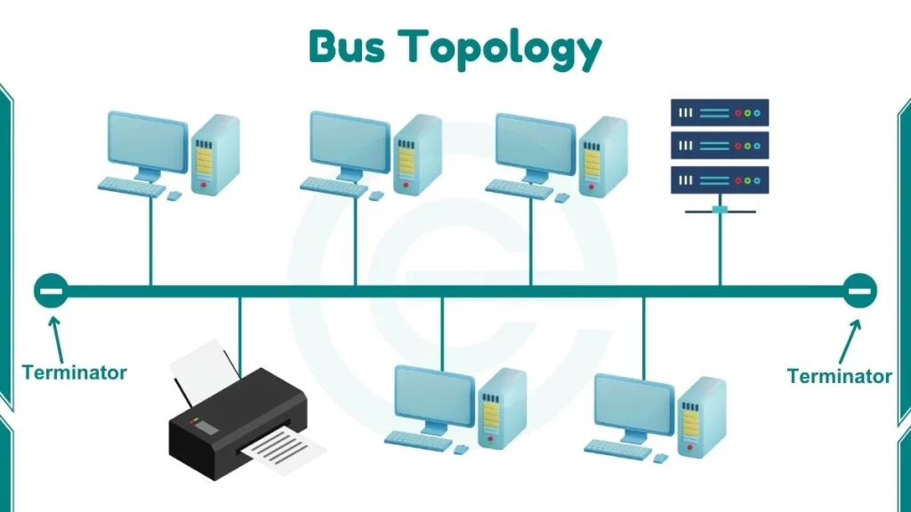

# Introduction to Computer Networks
## Index:
- [Components](#components)
- [OSI Model](#osi-model)
   - Layer 1 - Physical Layer
   - Layer 2 - Data Link Layer
   - Layer 3 - Network Layer
   - Layer 4 - Transport Layer
   - Layer 5 - Session Layer
   - Layer 6 - Presentation Layer
   - Layer 7 - Application Layer
- Network Types
- Network Topology
- Common Ports
- Exercises

## 1. Components
 **Router** – Connects multiple networks and forwards packets based on IP addresses.

 **Switch** – Connects devices within the same network and forwards frames based on MAC addresses.

 **Bridge** – Divides networks into segments to reduce collisions and improve efficiency.

 **Hub** – A basic device that broadcasts data to all connected devices (Layer 1).

 **Wireless Access Point (WAP)** – Provides wireless connectivity to a wired network.

 **Gateway** – Translates data between different protocols or network architectures.

 **Firewall** – Controls incoming and outgoing traffic based on security rules.

**Intrusion Detection System (IDS)** – Monitors traffic for suspicious activity and alerts administrators.

**Intrusion Prevention System (IPS)** – Monitors and actively blocks detected threats.

**Network Interface Card (NIC)** – Hardware that allows a device to access a network.

## 2. OSI Model
 
 

### <ins>Layer 1 - Physical</ins>      
This layer transmits the electrical signal as bits (0's and 1's) from one node to the next. It is responsible for providing a clock to synchronize the bits transmissions and the rate of transmission. Layer 1 also determines the network topology and the transmission mode: simplex (one-way communication), half-duplex(alternates between sending and receiving), full duplex (simultaneous transmission and receiving)
\
Primary Devices/Protocols: **Hub**, **Coaxial Cable**, **Ethernet Cable**, **Repeater**, **Modem**
\
[[Back to Top]](#introduction-to-computer-networks)

---

### <ins>Layer 2 - Data Link</ins>
The Data Link layer is responsible for **node-to-node delivery**, framing, and **MAC addressing**. It ensures error detection and handles flow control on the local network segment. It is divided into two sublayers: **LLC (Logical Link Control)** and **MAC (Media Access Control)**.
\
Primary Devices/Protocols: **Switch**, **Bridge**, **MAC Address**, **ARP**, **Ethernet**
\
[[Back to Top]](#introduction-to-computer-networks)

---

### <ins>Layer 3 - Network</ins>
The Network layer handles **logical addressing (IP addresses)**, routing, and path selection. It determines how packets travel between networks using routers and routing protocols.
\
Primary Devices/Protocols: **Router**, **IPv4/IPv6**, **OSPF**, **BGP**, **ICMP**
\
[[Back to Top]](#introduction-to-computer-networks)

---

### <ins>Layer 4 - Transport</ins>
This layer provides **end‑to‑end communication**, segmentation, error recovery, and flow control. It uses port numbers to differentiate applications.
\
Primary Devices/Protocols: **TCP**, **UDP**, **Ports**
\
[[Back to Top]](#introduction-to-computer-networks)

---

### <ins>Layer 5 - Session</ins>
The Session layer establishes, manages, and terminates sessions between applications. It synchronizes communication and handles dialogue control.
\
Primary Devices/Protocols: **API Calls**, **Sockets**, **NetBIOS**
\
[[Back to Top]](#introduction-to-computer-networks)

---

### <ins>Layer 6 - Presentation</ins>
This layer formats and translates data for the application layer. It handles **encryption, compression, and encoding**.
\
Primary Devices/Protocols: **SSL/TLS**, **JPEG**, **MP3**, **ASCII**, **Unicode**
\
[[Back to Top]](#introduction-to-computer-networks)

---

### <ins>Layer 7 - Application</ins>
This layer interacts directly with the user and provides network services to applications such as email, web browsing, and file sharing.
\
Primary Devices/Protocols: **HTTP/HTTPS**, **SMTP**, **FTP**, **DNS**, **DHCP**
\
[[Back to Top]](#introduction-to-computer-networks)

---

## Network Types
Peer-to-Peer 
Client-Server 

## Network Topology
### Bus

A single central cable (the bus) connects all devices. Simple but prone to collisions.

### Tree
A hierarchical structure combining characteristics of star and bus topologies.

### Star
All devices connect to a central switch or hub. Most common LAN topology.

### Mesh
Devices interconnect directly with many others for redundancy and reliability.

### Ring
Devices form a circular path. Data moves in one direction (or two for dual ring).

### Fully Connected
A type of mesh where every device connects to every other device.

### <ins>Small Office Home Office (SOHO)</ins>
Typically uses a single router providing DHCP, NAT, WiFi, and basic firewalling.

### <ins>2-Tier</ins>
Access layer connects to a distribution layer. Common for mid-sized networks.

### 3-Tier
Core → Distribution → Access layers for large-scale enterprise networks.

### Spine-Leaf
Modern data center design enabling predictable performance.

### Cloud
Network resources are hosted on cloud infrastructure.

### On-Premises
Network resources are hosted locally in a private data center.

### Hybrid
Combines cloud and on-premises resources for flexibility.

## Common Terms
**LAN** – Local Area Network, typically within a building.

**WAN** – Wide Area Network, spanning large geographic areas.

**MAN** – Metropolitan Area Network, city-scale networks.

**PAN** – Personal Area Network, e.g., Bluetooth devices.

**ISP** – Internet Service Provider.

**DMZ** – A semi-secure network separating internal networks from the internet.

**VPN** – Virtual Private Network for encrypted remote access.

**VLAN** – Virtual LAN used to segment networks logically.

**ICMP** – Internet Control Message Protocol for diagnostics (e.g., ping).

**ARP** – Address Resolution Protocol maps IP to MAC hardware addresses.

**TCP** – Reliable, connection-oriented protocol.

**UDP** – Fast, unreliable, connectionless protocol.

**MAC Address** – Hardware address burned into NICs.

**IPv4** – 32-bit addressing system.

**IPv6** – 128-bit addressing system.

**APIPA** – Automatic private addressing when DHCP fails (169.254.x.x).

**Private IP** – Non-routable internally used addresses.

**Public IP** – Routable addresses on the internet.

**Spanning Tree Protocol (STP)** – Prevents switching loops.

**SSH** – Secure remote terminal access.

**FTP** – File Transfer Protocol.

**SMB** – File and printer sharing on Windows networks.

**SNMP** – Network monitoring protocol.

**SMTP** – Email sending protocol.

**LDAP** – Directory service protocol.

**LACP** – Combines multiple links into a single logical channel.

**NAT** – Translates private IPs to public IPs.

**NTP** – Network Time Protocol for time synchronization.

**DHCP** – Dynamically assigns IP addresses.

**Neighbor Discovery Protocol** – IPv6 equivalent of ARP.

**Telnet** – Unencrypted remote terminal protocol.

**IMAP** – Email retrieval protocol.

**POP3** – Older email retrieval protocol.

**OSPF** – Link-state routing protocol.

## Common Ports
Port | Protocol
-----|---------
`20` | FTP Data Transfer
`21` | FTP Control
`22` | SSH (Secure Shell)
`23` | Telnet
`25` | SMTP (Simple Mail Transfer Protocol)
`53` | DNS (Domain Name System)
`67` | DHCP Server
`68` | DHCP Client
`69` | TFTP (Trivial File Transfer Protocol)
`80` | HTTP (Hypertext Transfer Protocol)
`110` | POP3 (Post Office Protocol v3)
`119` | NNTP (Network News Transfer Protocol)
`123` | NTP (Network Time Protocol)
`135` | Microsoft RPC
`137` | NetBIOS Name Service
`138` | NetBIOS Datagram Service
`139` | NetBIOS Session Service
`143` | IMAP (Internet Message Access Protocol)
`161` | SNMP Query
`162` | SNMP Trap
`179` | BGP (Border Gateway Protocol)
`389` | LDAP (Lightweight Directory Access Protocol)
`443` | HTTPS (Secure HTTP)
`445` | SMB (Server Message Block)
`500` | ISAKMP / IKE (VPN)
`514` | Syslog
`587` | SMTP (Submission)
`631` | IPP (Internet Printing Protocol)
`636` | LDAPS (Secure LDAP)
`989` | FTPS Data
`990` | FTPS Control
`993` | IMAPS (Secure IMAP)
`995` | POP3S (Secure POP3)
`1080` | SOCKS Proxy
`1433` | Microsoft SQL Server
`1521` | Oracle Database
`1701` | L2TP (VPN)
`1723` | PPTP (VPN)
`1812` | RADIUS Authentication
`1813` | RADIUS Accounting
`1883` | MQTT (IoT Messaging)
`2049` | NFS (Network File System)
`3306` | MySQL
`3389` | RDP (Remote Desktop Protocol)
`3690` | SVN (Subversion)
`4333` | mSQL
`5060` | SIP (VoIP Signaling)
`5061` | Secure SIP
`5140` | RemoteSyslog
`5432` | PostgreSQL
`5900` | VNC Remote Desktop
`6379` | Redis
`8080` | HTTP Alternate / Proxy

## Practice Labs & Exercises
### **Lab 1: Identify Network Hardware**
**Objective:** Reinforce understanding of components.
1. Create a diagram of a small network including: router, switch, WAP, firewall, and 3 client devices.
2. Label each device and specify which OSI layer it primarily operates at.
3. Write a short explanation of the function of each device.

### **Lab 2: Subnetting Practice**
**Objective:** Strengthen IP addressing and subnetting skills.
1. Given the network `192.168.10.0/24`, create 4 equal subnets.
2. List the network address, broadcast address, and usable range for each.
3. Determine which subnet the IP `192.168.10.77` belongs to.

### **Lab 3: Packet Flow Through the OSI Model**
**Objective:** Understand how data travels through OSI layers.
1. Choose an application (web browsing, email, SSH).
2. Describe each OSI layer's role as a packet moves from source to destination.
3. Identify which protocols are used at each layer.

### **Lab 4: Port Identification Drill**
**Objective:** Memorize key ports.
1. Randomly select 10 ports from the common ports table.
2. Write the associated protocol **from memory**, then check your answers.
3. Repeat daily until you're consistently 90% accurate.

### **Lab 5: Build a VLAN Scenario**
**Objective:** Understand segmentation.
1. Create a network with at least 3 departments.
2. Assign each department a VLAN.
3. Explain how VLANs improve security and reduce broadcast traffic.
4. Describe which device handles inter-VLAN routing.

### **Lab 6: Wi-Fi Troubleshooting Simulation**
**Objective:** Reinforce wireless concepts.
1. List 5 possible reasons a device cannot connect to Wi-Fi.
2. Propose a troubleshooting step for each.
3. Identify which OSI layer each problem belongs to.

### **Lab 7: Create a Routing Table**
**Objective:** Understand routing decisions.
1. Create a simple routing table with at least 5 entries.
2. For each destination network, assign a next-hop IP.
3. Given 3 example packets, determine which route would be used.

### **Lab 8: Network Topology Design**
**Objective:** Apply topology concepts.
1. Create one of each topology (star, mesh, tree, ring, bus).
2. Write: advantages, disadvantages, and real-world examples.
3. Choose the best topology for a small business and justify your choice.

### **Lab 9: Packet Capture Analysis**
**Objective:** Learn protocol behavior.
1. Install a packet analyzer (like Wireshark).
2. Capture traffic for 30 seconds.
3. Identify packets for at least 5 protocols (DNS, HTTP, ARP, DHCP, etc.).
4. Note the source, destination, and purpose of each.

### **Lab 10: Firewall Rule Creation**
**Objective:** Understand security filtering.
1. Write 10 example firewall rules.
   - Allow HTTP to a web server.
   - Block Telnet.
   - Allow RDP only from admin subnet.
2. Explain the impact of each rule.
3. Identify which rules should come first based on best practices.

