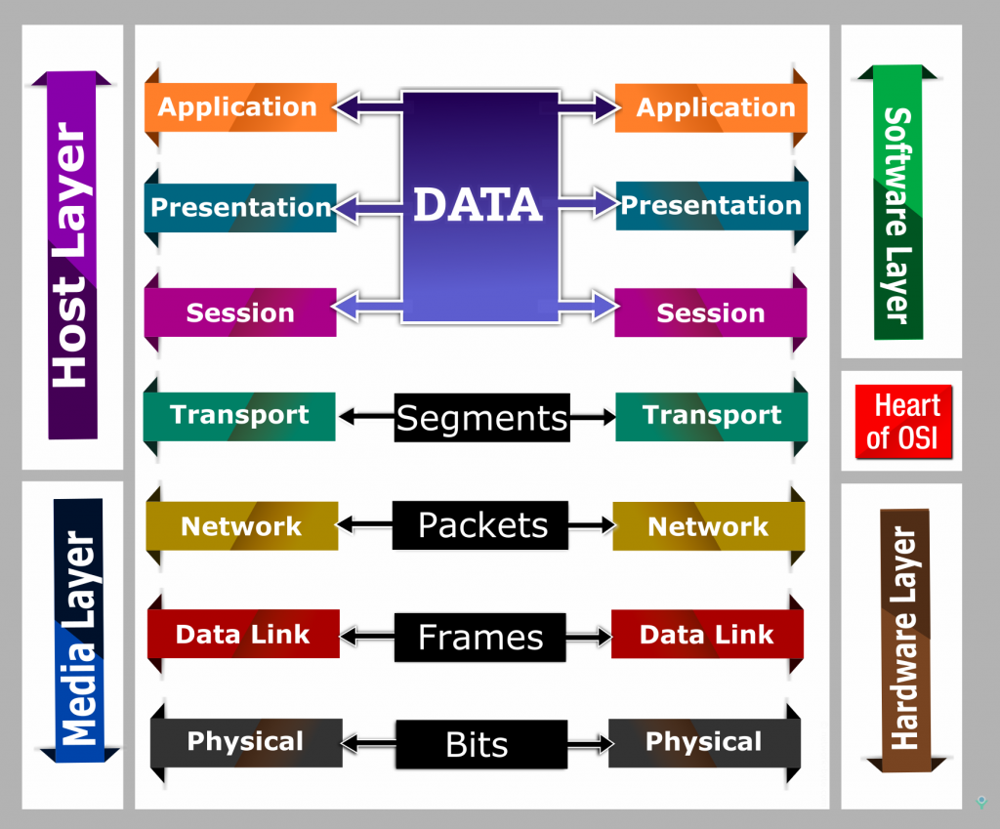
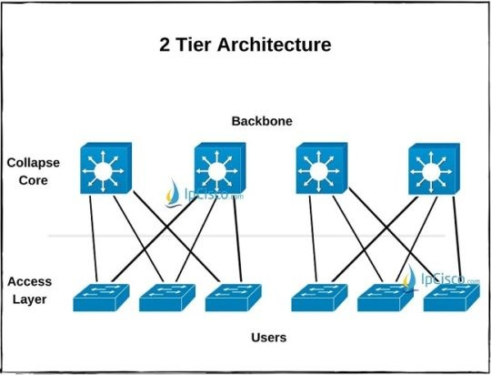

# Introduction to Computer Networks
## Index:
1. [Components](#components)
2. [OSI Model](#osi-model)
   - test
   - test
     - test  

## 1. Components
Router 
Switch 
Bridge 
Hub 
Wireless Access Point 
Gateway 
Firewall 
Intrusion Detection System 
Intrusion Prevention System 
Network Interface Card 

## 2. OSI Model
 
 

### <ins>Layer 1 - Physical</ins>      

This layer transmits the electrical signal as bits (0's and 1's) from one node to the next. It is responsible for providing a clock to synchronize the bits transmissions and the rate of transmission. Layer 1 also determines the network topology and the transmission mode: simplex (one-way communication), half-duplex(alternates between sending and receiving), full duplex (simultaneous transmission and receiving)
\
\
Primary Devices/Protocols: **Hub**, **Coaxial Cable**, **Ethernet Cable**, **Repeater**, **Modem**
\
[[Back to Top]](#introduction-to-computer-networks)

---

### <ins>Layer 2 - Data Link</ins>
<!-- INSERT DESCRIPTION HERE-->
\
[[Back to Top]](#introduction-to-computer-networks)

---

### <ins>Layer 3 - Network</ins>
<!-- INSERT DESCRIPTION HERE-->
\
[[Back to Top]](#introduction-to-computer-networks)

---

### <ins>Layer 4 - Transport</ins>
<!-- INSERT DESCRIPTION HERE-->
\
[[Back to Top]](#introduction-to-computer-networks)

---

### <ins>Layer 5 - Session</ins>
<!-- INSERT DESCRIPTION HERE-->
\
[[Back to Top]](#introduction-to-computer-networks)

---

### <ins>Layer 6 - Presentation</ins>
<!-- INSERT DESCRIPTION HERE-->
\
[[Back to Top]](#introduction-to-computer-networks)

---

### <ins>Layer 7 - Application</ins>
<!-- INSERT DESCRIPTION HERE-->
\
[[Back to Top]](#introduction-to-computer-networks)

---

## Network Types
Peer-to-Peer 
Client-Server 

## Network Topology
### Bus
### Tree
### Star
### Mesh
### Ring
### Fully Connected
### <ins>Small Office Home Office (SOHO)</ins>
### <ins>2 Tier</ins>

### 3 Tier (https://ipcisco.com/lesson/network-topology-architectures/)
### Spine-Leaf
### Cloud
### On-Premises
### *Hybrid

## Common Terms
LAN 
WAN 
MAN 
PAN 
ISP 
DMZ 
VPN 
VLAN 
ICMP 
ARP 
TCP 
UDP 
MAC Address 
IPv4 
IPv6 
APIPA 
Private IP 
Public IP 
Spanning Tree Protocol (STP) 
SSH 
FTP 
SMB 
SNMP 
SMTP 
LDAP 
LACP 
Network Address Translation (NAT) 
Network Time Protocol (NTP) 
Dynamic Host Configuration Protocol (DHCP) 
Neighbor Discovery Protocol 
Telnet 
IMAP 
POP3 
Open Shortest Path First (OSPF) 

## Common Ports [[Back to Top]](#introduction-to-computer-networks)
Port | Protocol
-----|---------
`20` |
`21` |**FTP**
`22` |**SSH**
`23` |
`25` |
`80` |**HTTP**
`110`|
`143`|
`443`|**HTTPS**
