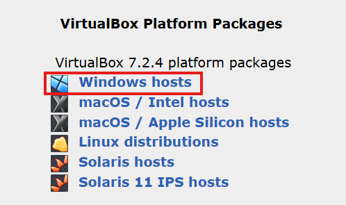
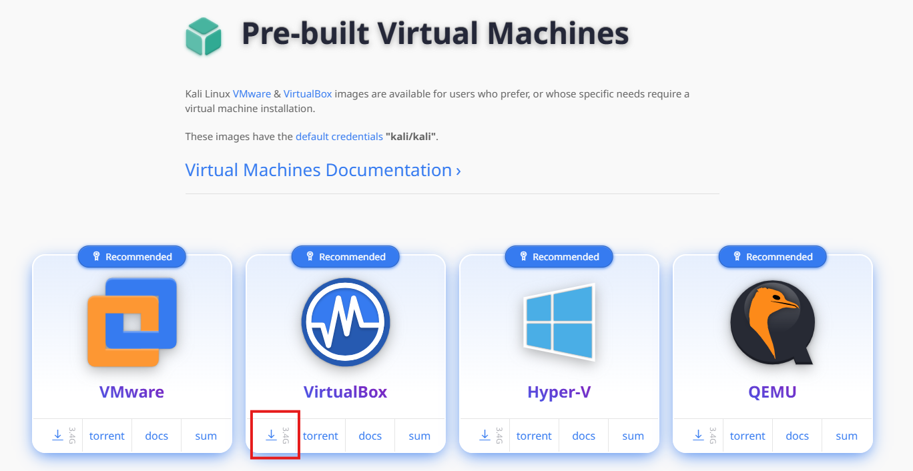
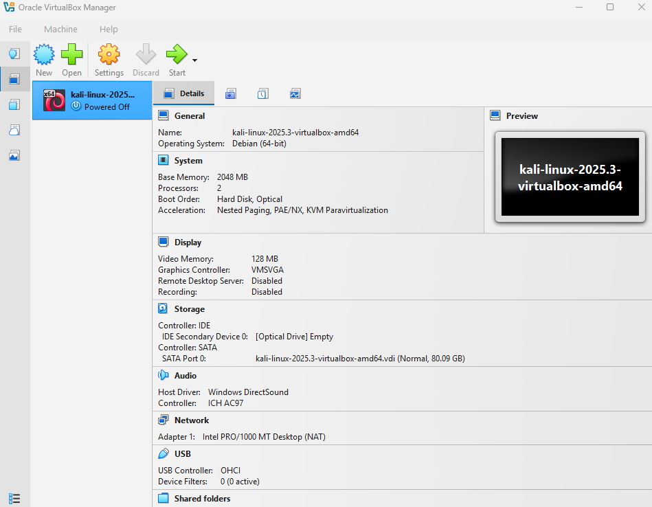
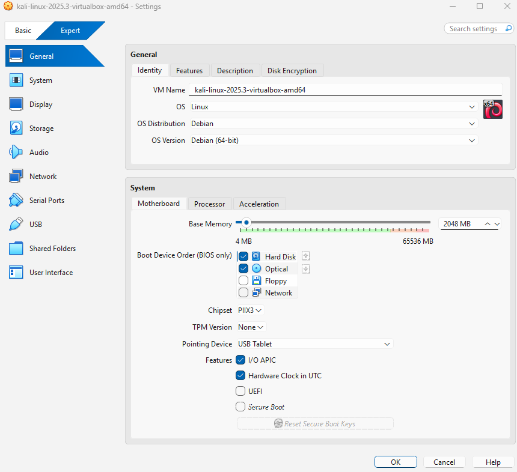
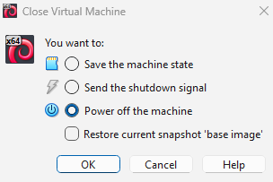

# Setting up Virtual Box

## [Virtual Box](https://www.virtualbox.org/wiki/Downloads)

Select the option that applies to you. This this example we will select "Windows hosts" to download the file. 

Double click the downloaded file and follow the prompts. Agree to the terms and select the default configurations and then select install and finish.

For this example walkthrough we will download and install a distribution of [Kali Linux](https://www.kali.org/get-kali/#kali-platforms).

Select the option on the right to download a pre-built virtual machine. 

Then select the version that you want. For this walkthrough, select VirtualBox:

Right click and select "Extract All", then save the image onto your machine. You should now see a .vbox and a .vdi file. Double click the .vbox file. This should open Virtual Box as such: 

This will load the images with a default configuration. Note that this machine has a very small amount of memory and processors. We con change this by clicking on the settings cog. 

We can increase memory. It is reccommended to stay within the green range on the slider. For my system, I will give it 16382MB and 16 CPU Cores in the Processor section. You may give it more resources if necessary. 

There are many more options. Of note we will look at the network settings. 

Note that the adapter is set to Network Address Translation (NAT) by default. NAT is a networking mode commonly used in virtual machines to enable access to external networks, such as the internet, without requiring direct exposure of the virtual machine (VM) to the host network. It acts as a bridge between the VM and the host, mapping internal IP addresses of the VM to the host's external IP address and port.

Select OK, then with the virtual machine that we just configured selected, click the start button. The virtual machine will begin the boot process. After booting You will see a login screen. The default credentials are: 

Username: `kali`
Password: `kali`

You can maximize the window and now are you all set up with your own Kali Virtual Machine!

Once you are done using the machine, you can power it down just like a normal machine by either selecting the machine tab or selecting the X at the top right of the window (pictured below). 

You have several options. The top option will close the VM, but preserve the state so that it comes up exactly the way you left it. Send shutdown signal and powering of the machine will fully shutdown the VM like a physical machine. When powering off the machine, if you have any snapshots saved it will give you the option to revert back to a snapshot with a check box.

### Useful Tips Inside the VM

Escaping: If your cursor is stuck inside of the VM, you can escape by clicking the "host key". This is usually set to the CRTL button on the right side of the keyboard by deafult. 