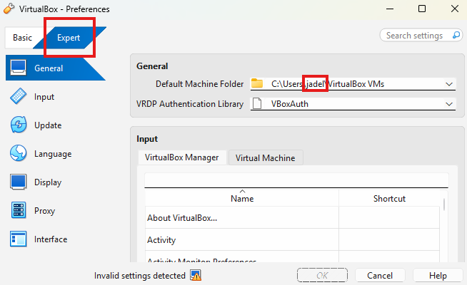
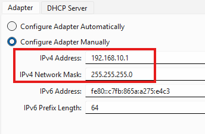
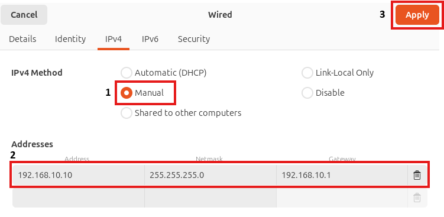
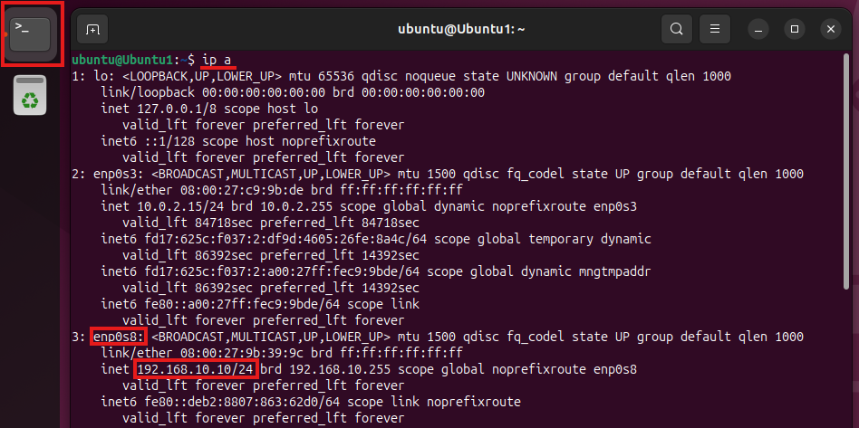
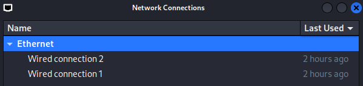
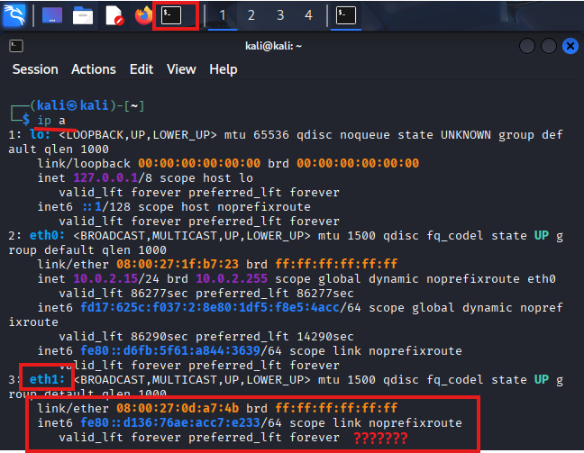
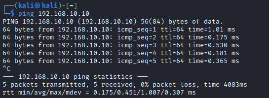
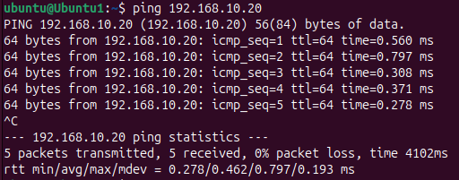

# Setting up a Virtual Network in Virtual Box

This walkthrough assumes that you have done the previous walkthrough, or that you already have multiple VMs created.

In VirtualBox, select the File tab at the top left of the window and select "Preferences..."

Then click on "Expert". Now select Cancel. 

Now there will be more options available on the left side of the screen. Select the Network Icon, then select Create. 

With the new adapter selected, fill in the following information:

The first number could be any number in the range of 192.168.1-255.1, or really any other private IP range. 

The second number is the subnet mask, which tells the network adapter that is can route to anything that matches the first 3 octets of the given IPv4 Address. 

Now navigate to your machines. Select the first machine and then click on settings.

Select the network tab on the left. Now select Adapter 2 (the first one needs to remain to access the internet). select Host-only adapter in the "Attached to" drop down. Finally select the adapter that we just created in the previous step. Click OK.  

Follw the same steps as above for your other Virtual Machine or Machines. 

Once you complete these steps, open both machines. We will now configure their adapters with static IPs on the 192.168.10.1/24 subnet. 

## Configuring Static IP on Ubuntu

In the Ubuntu VM, click the bottom left icon and type settings into the search bar. Then Select system settings.

Select network settings, then click on the settings cog for the second Ethernet adapter. 

Now select IPv4 and configure it as such. Select Apply.

To verify that the change took effect. Open a terminal window and type `ip a` and hit enter. Search for the name of the Ethernet interface that you changed.

If the change did not take effect. Open the network setting and turn the Ethenet adapter on and off again with the toggle next to the settings cog.

## Configuring Static IP on Kali

In the Kali VM, Click the dragon icon in the top left of the screen and type "network" in the search bar. Select Advanced Network Configuration. 

Double click Wired connection 2.

Note the name of the Ethernet Adapter. In this case it is eth1. 

Click on IPv4 Settings, then configure the adapter as shown below.

Click save in the bottom right, and close the Network Connections window. 

To verify that the IP address was properly set, click on the terminal icon in the top left of the VM screen and run `ip a` in the terminal to verify that the ip was set on the corresponding Ethernet adapter. 

After changin the IP, the Networking service will not automatically detect the change and restart like it did in Ubuntu. 

In the terminal window, run `sudo service NetworkManager restart`, and you will see that the ip is now configured!

## Testing That the Connection Works

Ensure that both machines are up and running.

From the Kali terminal, run `ping 192.168.10.15` to see if the hosts can communicate. Press CTRL+C to escape. 

Now in the Ubuntu VM, ping the Kali box.

Congradulations! You have properly setup a virtual network!